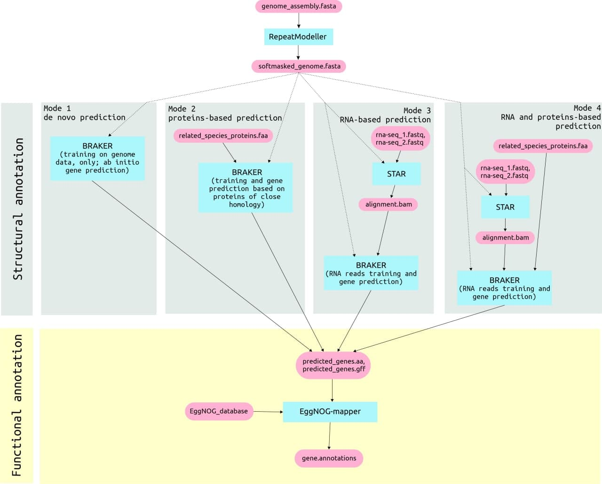

# PANIMAN (Pipeline for ANIMal genomes ANnotation)
## Workflow

## Install, set and run
PANIMAN is available in conda, to install and set is use following commands:
1) Download PANIMAN in separate conda environment: `conda create -n paniman -c conda-forge -c bioconda -c aglab paniman`
2) Activate the environment: `conda activate paniman`
3) EggNOG-mapper database (~50GB) is required to run PANIMAN. 
   You can download it or set your own one if you have it already. Use `paniman_download_db` tool to set or download databases. Examples:
   ```
   # Download EggNOG db
   paniman_download_db -o /path/to/database/directory
   
   # Set your EggNOG db
   paniman_download_db -e /path/to/eggnog/database
   ```
4) To run PANIMAN on your reads use one of the following commands:
   ```
   # If you have only assembly
   paniman -m fasta -a /path/to/assembly.fasta -t 32 -o /path/to/outdir

   # If you have assembly and closest reference proteins
   paniman -m fasta_faa -a /path/to/assembly.fasta -f /path/to/proteins.fasta -t 32 -o /path/to/outdir

   # If you have assembly and RNA-seq reads
   paniman -m fasta_rna -a /path/to/assembly.fasta -1 /path/to/forward_read_1.fastq -2 /path/to/reverse_read_2.fastq -t 32 -o /path/to/outdir

   # If you have assembly, closest reference proteins and RNA-seq data 
   paniman -m fasta_rna_faa -a /path/to/assembly.fasta -f /path/to/proteins.fasta -1 /path/to/forward_read_1.fastq -2 /path/to/reverse_read_2.fastq -t 32 -o /path/to/outdir
   ```

## Modes

All modes are used [RepeatMasker](http://www.repeatmasker.org/RepeatModeler/) tool for repeats masking, modes are:
1) **FASTA** - [BRAKER2](https://github.com/Gaius-Augustus/BRAKER) predicts genes on genome data training only
2) **FASTA_FAA** - [BRAKER2](https://github.com/Gaius-Augustus/BRAKER) predicts genes on proteins and genome data training 
3) **FASTA_RNA** - [BRAKER2](https://github.com/Gaius-Augustus/BRAKER) predicts genes on RNA-seq and proteins data training. [STAR](https://github.com/alexdobin/STAR) is used to align RNA reads
4) **FASTA_RNA_FAA** - [BRAKER2](https://github.com/Gaius-Augustus/BRAKER) predicts genes on genome, RNA-seq and proteins data training. [STAR](https://github.com/alexdobin/STAR) is used to align RNA reads

After genes are predicted PANIMAN runs [Eggnog-mapper](https://github.com/eggnogdb/eggnog-mapper) to define functions of a genes
## Command line options 

```
-h, --help            show this help message and exit
-m {fasta,fasta_rna,fasta_faa,fasta_rna_faa}, --mode {fasta,fasta_rna,fasta_faa,fasta_rna_faa}
                     mode to use [default = fasta]
-a ASSEMBLY, --assembly ASSEMBLY
                     path to asssembly fasta file
-1 FORWARD_RNA_READ, --forward_rna_read FORWARD_RNA_READ
                     path to forward rna-seq read
-2 REVERSE_RNA_READ, --reverse_rna_read REVERSE_RNA_READ
                     path to reverse rna-seq read
-f FAA, --faa FAA     path to protein fasta file (.faa), required for fasta_faa and fasta_rna_faa modes
-o OUTDIR, --outdir OUTDIR
                     output directory [default is folder of your assembly file]
-t THREADS, --threads THREADS
                     number of threads [default == 8]
-d, --debug           debug mode
```
## References
1) Köster, J., & Rahmann, S. (2012). Snakemake—a scalable bioinformatics workflow engine. Bioinformatics, 28(19), 2520-2522. [https://doi.org/10.1093/bioinformatics/bts480]
2) Chen, Nansheng. "Using Repeat Masker to identify repetitive elements in genomic sequences." Current protocols in bioinformatics 5.1 (2004): 4-10. [https://doi.org/10.1002/0471250953.bi0410s05]
3) Brůna, Tomáš, et al. "BRAKER2: Automatic eukaryotic genome annotation with GeneMark-EP+ and AUGUSTUS supported by a protein database." NAR genomics and bioinformatics 3.1 (2021): lqaa108. [https://doi.org/10.1093/nargab/lqaa108]
4) Dobin, Alexander, et al. "STAR: ultrafast universal RNA-seq aligner." Bioinformatics 29.1 (2013): 15-21. [https://doi.org/10.1093/bioinformatics/bts635]
2) Huerta-Cepas, J., Szklarczyk, D., Heller, D., Hernández-Plaza, A., Forslund, S. K., Cook, H., ... & Bork, P. (2019). eggNOG 5.0: a hierarchical, functionally and phylogenetically annotated orthology resource based on 5090 organisms and 2502 viruses. Nucleic acids research, 47(D1), D309-D314. [https://doi.org/10.1093/nar/gky1085]
